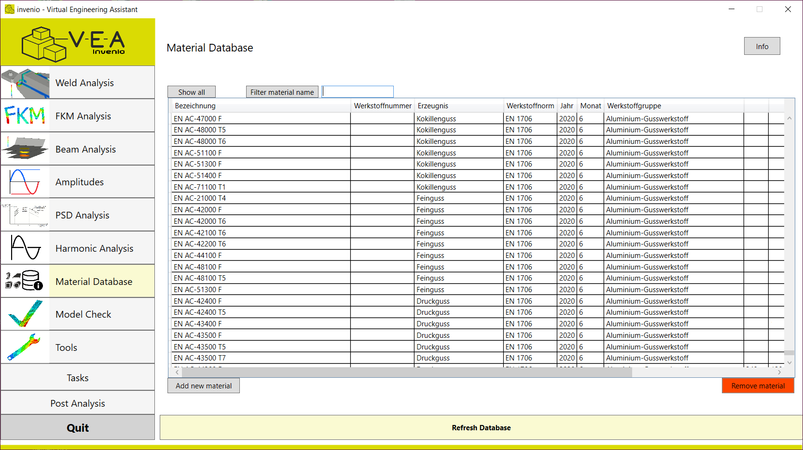

# Virtual Engineering Assistant

** The Virtual Engineering Assistant is a modular software suite by invenio that empowers simulation engineers to design safer, more efficient products while minimizing end-customer costs. By streamlining engineering workflows and enhancing design safety, it supports smarter, faster product development.

**Author**: Tim Beinert – Founder and Maintainer of the Virtual Engineering Assistant

> 🛠️ _This software is proprietary. This repository provides an overview and documentation only. No source code is included._

---

### Overview

The Virtual Engineering Assistant combines powerful tools and domain-specific knowledge to:
- Simulations using the Finite Element Method
- Accurately represent the physical performance of virtual products
- Physical and mathematical algorithms in the fields of engineering mechanics and geometry
- Improve safety and performance during design
- Reduce development cycles and final product costs

📖 **Featured in Digital Engineering Magazin**  
A technical article about this software suite was published in *Digital Engineering Magazin*, highlighting the methodology, features, and real-world applications.

## 📋 Key Features

- **Modular Architecture** - New modules can easily be integrated into the main suite
- **Scriptable Workflows** – Standardized procedures accessible to non-developers
- **Database Integration** – External and internal databases can be connected and modified to suit workflow-specific needs

## 🧩 Use Cases

The suite is used in industries like automotive, industrial and civil engineering to:
- Optimize virtual prototypes
- To guarantee accurate configuration and structure of the digital twin model
- Incorporate customer feedback quickly into simulation loops

## 💬 Challenges Tackled
- Accurate representation of physics, step-by-step debugging and testing to ensure functionality.
- Efficient data structures to handle large amount of data.
- Controlling and interfacing with commercial simulation and modeling software to streamline complex workflows
- Navigating interdisciplinary collaboration with both team members and customers represented a significant challenge requiring adaptability and clear communication.
- Embedding standardized procedures into a scripting environment to allow technical users — without programming expertise — to adapt and modify these workflows as needed.

## 🖼️ User Interface Highlights

The following screenshots illustrate key aspects of the Virtual Engineering Assistant in action:

### 🧭 Main Interface
  
*The main dashboard of the Virtual Engineering Assistant with an intuitive layout for the selection of integrated modules.*

---

### 🎯 Integration with Commercial Visualization Tools
  
*Example of direct interaction with industry-standard visualization software for post-processing and interpretation.*

---

### 🧪 Customizable Material Database
  
*Integrated and editable material database, allowing engineers to tailor material properties and data for specific use cases.*
